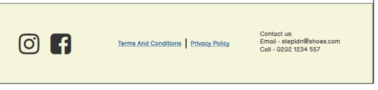
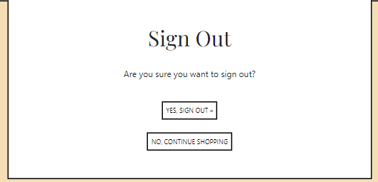
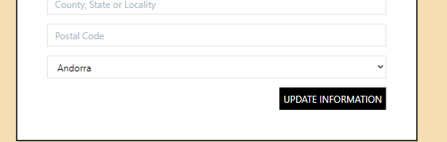

# StepLDN

## Introduction

<!--Write intro -->

 

[Click here to go to the live website!](<!-- Insert AmIResponsive image -->) 

## Table of contents

1. [Wireframes](#wireframes)
2. [User Stories](#user-stories)
3. [Objectives](#objectives)
4. [Features](#features)
    - [Navigation Bar](#navigation-bar)
    - [Footer](#footer)
    - [Contact](#contact)
    - [Newsletter](#newsletter)
    - [Create Account Feature](#create-account-feature)
    - [Sign In Feature](#sign-in-feature)
    - [Sign Out Feature](#sign-out-feature)
    - [Profile](#profile)
    - [Order History](#order-history)
    - [Product Details Feature](#product-details-feature)
    - [Add Products](#add-products)
    - [Edit Products](#edit-products)
    - [Bag Feature](#bag-feature)
    - [Checkout Feature](#checkout-feature)
5. [Testing](#testing)
    - [HTML](#html)
    - [CSS](#css)
    - [Python](#python)
    - [Manual Testing](#manual-testing)
6. [Bugs](#bugs)
7. [Deployment](#deployment)
8. [Credits](#credits)
  
## Wireframes

### Home 

[Table of contents](#table-of-contents)

### Products

[Table of contents](#table-of-contents)

### Product Details

[Table of contents](#table-of-contents)

### Create Account

[Table of contents](#table-of-contents)

### Sign in 

[Table of contents](#table-of-contents)

### Sign out 

[Table of contents](#table-of-contents)

### My Account

In the interest of time, I ended up having one page to show both the account details and order history, but would like to impliment the my accounts page as shown in the wireframe along with the seperate my details page and order history page in my own time.

[Table of contents](#table-of-contents)

### Edit Details

[Table of contents](#table-of-contents)

### Bag

[Table of contents](#table-of-contents)

### Bag

[Table of contents](#table-of-contents)

## User stories

I used the GitHub projects board to log my user stories to help me manage my project. 
This helped me break the project down into smaller tasks that would be more manageable by moving them into the in-progress section whilst I focused on them. once a task was complete, I could move it into the done section to help me see my progress.

[Table of contents](#table-of-contents)

## Objectives

- I want the user to be able to see all products on one page but also have pages for the user to see the product details individually.
    - Was this achieved?
        -  Yes
    - How was this achieved?
        -  I had an all products view to be used on product.html and a product detail view to be used on product_detail.html both views getting information from the product model.

- I want the users to be able to sign up for an account, log in and out of the account.
    - Was this achieved?
        - Yes
    - How was this achieved?
        - Using all auth I was able to add a sign up page a log in page and a log out page that registers the details to allow each user to create their own account.

- I want the users to be able to add a product to their bag and view which products are in their bag.
    - Was this achieved?
        - Yes
    - How was this achieved?
        - This was done with two views, the first being view_bag allowing the user to view if their is anything in their bad on bag.html, and the second being add_to_bag allowing the user to press a button on the product_details.html page to add the item and view it on the bag.html page. 

- I want the users to be able to adjust the items in their bag.
    - Was this achieved?
        - Yes
    - How was this achieved?
        - Again this was done with two views, one to allow the user to adust the quantity of the items and another to delete the item from the bag.

- I want a summery of what is currently in the users shopping cart on the checkout page.
    - Was this achieved?
        - Yes
    - How was this achieved?
        - Withing the checkout view, i first request the information from the session of the bag and show this information using checkout.html.

- when the user has an account, I want the users to be able to comment on a piece of art.
    - Was this achieved?
        - Yes
    - How was this achieved?
        - In models.py I defined everything I need to make a comment in the Comment class, created a form in forms.py and used that within the post details view.

- I want the users to be able to make a purchase on the site.
    - Was this achieved?
        - Yes
    - How was this achieved?
        - Using stripe i was able to create a form for the users to fill out and purchase the items in their bag.

- I want the users to be able to see their previous orders
        - Yes
    - How was this achieved?
        - When the user is signed into their account the information of that users previous orders can be seen on profile.html under order history using the order_history view in the profiles app.

- I want the users to be able to sign up for a news letter.
    - Was this achieved?
        - Yes
    - How was this achieved?
        - In the home app there is a model 'subscribe' that is used in the index view, this view takes the users email address.

- I want the users to be able to leave a message for the site owner to read.
    - Was this achieved?
        - <!-- Half done, user can leave messgae, site owner cannot read this on site yet. -->
    - How was this achieved?
        - In the contact app there is a form the users can fill out, which they can find on contact.html page by clicking the contact us link in the footer. <!-- Add how the site owner can read this once done. -->

- I want the users to be able to leave a comment on a product.
    - Was this achieved?
        - <!-- Not yet. -->
    - How was this achieved?
        <!-- Add this once done -->

[Table of contents](#table-of-contents)
 
## Features

### Navigation Bar

- The navigation bar contains the links needed to use the website easily. This changes how it looks depending on the size of the screen it is being viewed on. 
    - On both the mobile and larger screen versions the brand logo is a link back to the home page. 
    - There is a search bar for users to search for products. On the mobile version this is in the for of a toggle button, so when you click on the search icon a search bar pops up below. 
    - The my account button's dropdown changes depending on if the user is loged in or out but also if the user is a site admin it is also slightly different. 
    When the user is logged in they see my profile and logout, however if the user is a site admin they also see product management. 
    If the user is logged out they see register and login buttons.
    - The bag item takes the user to their shopping bag and the number below also changes when items are added to the bag.
    - each button in the navigation bar has a dropdown that shows more specific categories within each category(mens, womens, childrens) except for accesories as there is one page for all accessories.
    These buttons cant be seen imediatly on the mobile version of the navigation as the user will have to click on the toggle button to see them, this is to save screen space.

[Table of contents](#table-of-contents)

### Footer

- The footer shows at the bottom of every page.
    - It includes social media links in the form of icons.
    - Links that lead to the terms & conditions, privacy policy and also a link to the site map.
    - The footer also has a section for users to contact the site owners in multiple way, via email, phone or also if they follow the 'via the site' link it takes them to a page where they can leave a message for the site owners through the website itsself.

[Table of contents](#table-of-contents)

### Contact

- When the link in the footer is followed to the contact page it brings the user to this form thtat they can submit to the admin. 

[Table of contents](#table-of-contents)

### Newsletter

-  On the home page there is a form that users can leave there email to sign up for a newsletter.

[Table of contents](#table-of-contents)

### Create Account Feature

- When a user clickes on the my account button in the navbar and then clicks on register, it brings them to the create an account page, this is a form for the user to fill out which allows them to create an account so they can keep there details saved and view previous orders.

[Table of contents](#table-of-contents)

### Sign In Feature

- The sign in page allows users to sign into there account if they have already registered.

[Table of contents](#table-of-contents)

### Sign Out Feature

- The sign out page allows users to sign out of there account if they are already signed in.

[Table of contents](#table-of-contents)

### Profile

- On the my profile page you can view your current saved delivery information, you can also update this by typing your changes into the fields provided anf hitting the update information button

[Table of contents](#table-of-contents)

### Order History

- Within the saem page as the profile details, just underneither you can view your oreder history if you have made any previous orders on the same account.

[Table of contents](#table-of-contents)

### Product Details Feature

- On the product detail page you can view the individual product, its description and price. 
    - You can choose the size of the product.
    - You can choose the quantitiy of the product.
    - At the bottom of the page you can choose to either add this item to your bag or go back to the products page to view other items.

[Table of contents](#table-of-contents)

### Add Products

- If the user is a site admin they can add products using the product management page. This page gives the admin a form they can fill out to add a new product.

[Table of contents](#table-of-contents)

### Edit Products

- If the user is a site admin the can edit exsisting products by clicking the edit button that will only show for them below the product images on both the products pages and products details pages. This page gives the admin a pre filled form they can edit to change the products details.
    - There will also be a delete button next to all edit buttons if the admin would like to delete the product all together.

[Table of contents](#table-of-contents)

### Bag Feature

- On the shopping bag page you can view the items in your bag.
    - You can change the quantity of the items in the bag by using the + and - buttons and pressing update.
    - You can also remove the item from the bag by clicking remove. 
- You can also view a quick summery of all the items in the bag.
- At teh bottom of the summery you have two choices, you can either click keep shopping to view more items or checkout which will take you to the ckeckout page.
- At the bottom of the summery if you have less than £50 worth of items in the bag it will tell you how much more you would need to spend if you want free delivery. This is because there is a banner that states users get free delivery if they spend £50 or more.

[Table of contents](#table-of-contents)

### Checkout Feature

- On the checkout page you get a view of the order summery first
- Then you see your order information, if you are logged into a profile that has details saved these details will pre fill for you, and you will just have to fill in your name and carad details.
- The stripe payment function allows users to make a purchase, by filling out the details and hitting complete order.
- There is also a button for the user to adjust the bag if they would like to make any changes before completing the order. 

[Table of contents](#table-of-contents)

## Testing

### HTML

HTML was tested using the official [W3C validator](https://validator.w3.org/nu/) 

## Home

The following errors/warnings were found:

1. <!-- Add errors -->
    - To fix this I

Retested: <!-- /Error/Warning cleared -->

## Bag

No errors were found.

## Checkout

No errors were found.

## Checkout Success

No errors were found.

## Contact

The following errors/warnings were found:

1. <!-- Add errors -->
    - To fix this I

Retested: <!-- /Error/Warning cleared -->

## Contact Success

<!-- ######## NOT WORKING ####### -->

The following errors/warnings were found:

1. <!-- Add errors -->
    - To fix this I

Retested: <!-- /Error/Warning cleared -->

## View Contact

<!-- ######## NOT MADE ####### -->

The following errors/warnings were found:

1. <!-- Add errors -->
    - To fix this I

Retested: <!-- /Error/Warning cleared -->

## Unsubscribe

The following errors/warnings were found:

1. <!-- Add errors -->
    - To fix this I

Retested: <!-- /Error/Warning cleared -->

## Add Product

No errors were found.

## Edit Product

No errors were found.

## Product Detail

No errors were found.

## Products

No errors were found.

## Profile

No errors were found.

## Login

No errors were found.

## Logout

The following errors/warnings were found:

1. <!-- Add errors -->
    - To fix this I

Retested: <!-- /Error/Warning cleared -->

## Sign Up

No errors were found.

### CSS
 
CSS was tested using the official [(Jigsaw) validator](https://jigsaw.w3.org/css-validator/)

No errors were found:

## base.css

<!-- Warnings ? -->

## checkout.css

<!-- Warnings ? -->

## profile.css

### Python
 
Python was tested using the official [PEP8](http://pep8online.com/)

The following errors were found:

To fix these I 

### Manual Testing 

<!-- Change for stepldn info -->

Component | Function | Does it work? | Fixed? 
--------- | --------- | ----------------- | ------ |
Navbar: Home | Takes user to home page | Yes | N/A
Navbar: News| Takes user to news page | Yes | N/A
Navbar: Gallery | Takes user to gallery  | Yes | N/A
Navbar: Register | Takes user to the sign up page  | Yes | N/A
Navbar: Login | Takes user to the login page  | Yes | N/A
Navbar: logout | Takes user to the log out page  | Yes | N/A
Register: Sign up button | Allows user to sign up  | Yes | N/A
Login: Sign in button | Allows user to sign in  | Yes | N/A
Logout: Sign out button | Allows user to sign out  | Yes | N/A
News: News post slug links | Takes user to relevant news post details page  | Yes | N/A
Gallery: Post slug link | Takes user to relevant post details page | Yes | N/A
Gallery posts: like and unlike button | Allows user to like or unlike a post when logged in  | Yes | N/A
Gallery posts: Submit button | Allows user to leave a comment for the admin to validate and eventually for everyone to view on the page  | Yes | N/A 

## Bugs

I ran into this error message:

I realised that I was missing #

This is how it rendered:	

I originally had written #
so I tried this:

This didnt work so I also tried:

Then I noticed #

## Deployment

- Create a new app on heroku 
- In resources add heroku postgres
- In settings review config vars, copy the DATABASE_URL
- In gitpod make a file called env.py, use this to store our environment variables.
- make sure env.py is in gitignore file
- Add your secret key environment variable to both the env.py file and heroku config vars
- Reference the env file in the settings.py file.
- Add the secret key environment variable to settings.py.
- Highlight database section and comment it out, 
replace with the following:
DATABASES = {
   'default': dj_database_url.parse(os.environ.get("DATABASE_URL"))
}
- run migrations

## Credits

The run through project was helpful for getting me through the project.

Product images from: https://www.shutterstock.com/

Am I responsive: http://ami.responsivedesign.is/

To help with the SEO I used word tracker - https://www.wordtracker.com/?fpr=refer&fp_sid=bingof
