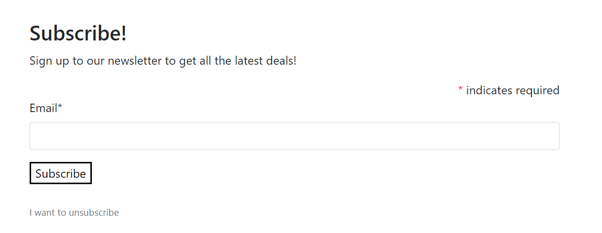
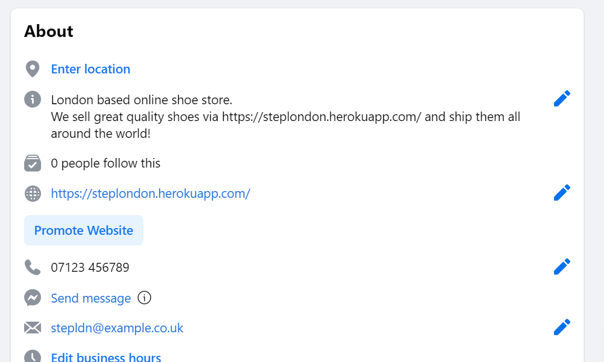

# StepLDN

## Introduction

StepLDN is an e-commerce store created for customers looking to get a new pair of shoes. The users will be able to purchase shoes and shoe accessories on the website. This project will use the following languages and frameworks: Django, Python, HTML, CSS and JavaScript. In the project I will set up an authentication mechanism that allows you users to purchase the products. If the user is logged in as a site admin they will also be able to create new products, see those new products show for everyone, update existing products and delete a product all together giving them full CRUD functionality over the products on the site.

[Click here to go to the live website!](https://stepldn.onrender.com) 

## Table of contents

1. [Wireframes](#wireframes)
2. [User Stories](#user-stories)
3. [Objectives](#objectives)
4. [Features](#features)
    - [Navigation Bar](#navigation-bar)
    - [Footer](#footer)
    - [Contact](#contact)
    - [Newsletter](#newsletter)
    - [Reviews](#reviews)
    - [Create Account Feature](#create-account-feature)
    - [Sign In Feature](#sign-in-feature)
    - [Sign Out Feature](#sign-out-feature)
    - [Profile](#profile)
    - [Order History](#order-history)
    - [Product Details Feature](#product-details-feature)
    - [Add Products](#add-products)
    - [Edit Products](#edit-products)
    - [Bag Feature](#bag-feature)
    - [Checkout Feature](#checkout-feature)
5. [SEO](#seo)
6. [Marketing](#marketing)
7. [Testing](#testing)
    - [HTML](#html)
    - [CSS](#css)
    - [Python](#python)
    - [Manual Testing](#manual-testing)
8. [Bugs](#bugs)
9. [Deployment](#deployment)
10. [Credits](#credits)
  
## Wireframes

### Home 

[Table of contents](#table-of-contents)

### Products

[Table of contents](#table-of-contents)

### Product Details

[Table of contents](#table-of-contents)

### Create Account

[Table of contents](#table-of-contents)

### Sign in 

[Table of contents](#table-of-contents)

### Sign out 

[Table of contents](#table-of-contents)

### My Account

In the interest of time, I ended up having one page to show both the account details and order history, but would like to implement the my accounts page as shown in the wireframe along with the separate my details page and order history page in my own time.

[Table of contents](#table-of-contents)

### Edit Details

[Table of contents](#table-of-contents)

### Bag

[Table of contents](#table-of-contents)

### Bag

[Table of contents](#table-of-contents)

## User stories

I used the GitHub projects board to log my user stories to help me manage my project. 
This helped me break the project down into smaller tasks that would be more manageable by moving them into the in-progress section whilst I focused on them. once a task was complete, I could move it into the done section to help me see my progress.

[Table of contents](#table-of-contents)

## Objectives

- I want the user to be able to see all products on one page but also have pages for the user to see the product details individually.
    - Was this achieved?
        -  Yes
    - How was this achieved?
        -  I had an all products view to be used on product.html and a product detail view to be used on product_detail.html both views getting information from the product model.

- I want the users to be able to sign up for an account, log in and out of the account.
    - Was this achieved?
        - Yes
    - How was this achieved?
        - Using all auth I was able to add a sign up page a log in page and a log out page that registers the details to allow each user to create their own account.

- I want the users to be able to add a product to their bag and view which products are in their bag.
    - Was this achieved?
        - Yes
    - How was this achieved?
        - This was done with two views, the first being view_bag allowing the user to view if their is anything in their bad on bag.html, and the second being add_to_bag allowing the user to press a button on the product_details.html page to add the item and view it on the bag.html page. 

- I want the users to be able to adjust the items in their bag.
    - Was this achieved?
        - Yes
    - How was this achieved?
        - Again this was done with two views, one to allow the user to adjust the quantity of the items and another to delete the item from the bag.

- I want a summery of what is currently in the users shopping cart on the checkout page.
    - Was this achieved?
        - Yes
    - How was this achieved?
        - Withing the checkout view, i first request the information from the session of the bag and show this information using checkout.html.

- when the user has an account, I want the users to be able to comment on a piece of art.
    - Was this achieved?
        - Yes
    - How was this achieved?
        - In models.py I defined everything I need to make a comment in the Comment class, created a form in forms.py and used that within the post details view.

- I want the users to be able to make a purchase on the site.
    - Was this achieved?
        - Yes
    - How was this achieved?
        - Using stripe i was able to create a form for the users to fill out and purchase the items in their bag.

- I want the users to be able to see their previous orders
        - Yes
    - How was this achieved?
        - When the user is signed into their account the information of that users previous orders can be seen on profile.html under order history using the order_history view in the profiles app.

- I want the users to be able to sign up for a news letter.
    - Was this achieved?
        - Yes
    - How was this achieved?
        - In the home app there is a model 'subscribe' that is used in the index view, this view takes the users email address.

- I want the users to be able to leave a message for the admin to read.
    - Was this achieved?
        - Yes 
    - How was this achieved?
        - In the contact app there is a form the users can fill out, which they can find on contact.html page by clicking the contact us link in the footer. When they fill out the contact form it saves in the admin for the site owner to read.

- I want the users to be able to leave a comment on a product.
    - Was this achieved?
        - Yes
    - How was this achieved?
        Under every product in the product details pages, there is a section where a user can leave a review for a product you can see this in the product app.

[Table of contents](#table-of-contents)
 
## Features

### Navigation Bar

- The navigation bar contains the links needed to use the website easily. This changes how it looks depending on the size of the screen it is being viewed on. 
    - On both the mobile and larger screen versions the brand logo is a link back to the home page. 
    - There is a search bar for users to search for products. On the mobile version this is in the for of a toggle button, so when you click on the search icon a search bar pops up below. 
    - The my account button's dropdown changes depending on if the user is logged in or out but also if the user is a site admin it is also slightly different. 
    When the user is logged in they see my profile and logout, however if the user is a site admin they also see product management. 
    If the user is logged out they see register and login buttons.
    - The bag item takes the user to their shopping bag and the number below also changes when items are added to the bag.
    - each button in the navigation bar has a dropdown that shows more specific categories within each category(men's, women's, children's) except for accessories as there is one page for all accessories.
    These buttons cant be seen immediately on the mobile version of the navigation as the user will have to click on the toggle button to see them, this is to save screen space.

[Table of contents](#table-of-contents)

### Footer

- The footer shows at the bottom of every page.
    - It includes social media links in the form of icons.
    - Links that lead to the terms & conditions, privacy policy and also a link to the site map.
    - The footer also has a section for users to contact the site owners in multiple way, via email, phone or also if they follow the 'via the site' link it takes them to a page where they can leave a message for the site owners through the website itself.

[Table of contents](#table-of-contents)

### Contact

- When the link in the footer is followed to the contact page it brings the user to this form that they can submit to the admin. 

[Table of contents](#table-of-contents)

### Newsletter

-  On the home page there is a form that users can leave their email to sign up for a newsletter.

[Table of contents](#table-of-contents)

### Reviews

- On each product detail page, at the bottom there is a section where users can leave a review of the product by filling out the form on the right side of the page and pressing submit. This will save to the admin panel and show a message so teh user knows that their review was submitted. The admin will have to approve of this message. once they have approved the message can be seen on the left hand hide of the page.

[Table of contents](#table-of-contents)

### Create Account Feature

- When a user clicks on the my account button in the navbar and then clicks on register, it brings them to the create an account page, this is a form for the user to fill out which allows them to create an account so they can keep there details saved and view previous orders.

[Table of contents](#table-of-contents)

### Sign In Feature

- The sign in page allows users to sign into there account if they have already registered.

[Table of contents](#table-of-contents)

### Sign Out Feature

- The sign out page allows users to sign out of their account if they are already signed in.

[Table of contents](#table-of-contents)

### Profile

- On the my profile page you can view your current saved delivery information, you can also update this by typing your changes into the fields provided and hitting the update information button

[Table of contents](#table-of-contents)

### Order History

- Within the same page as the profile details, just underneath you can view your order history if you have made any previous orders on the same account.

[Table of contents](#table-of-contents)

### Product Details Feature

- On the product detail page you can view the individual product, its description and price. 
    - You can choose the size of the product.
    - You can choose the quantity of the product.
    - At the bottom of the page you can choose to either add this item to your bag or go back to the products page to view other items.

[Table of contents](#table-of-contents)

### Add Products

- If the user is a site admin they can add products using the product management page. This page gives the admin a form they can fill out to add a new product.

[Table of contents](#table-of-contents)

### Edit Products

- If the user is a site admin the can edit existing products by clicking the edit button that will only show for them below the product images on both the products pages and products details pages. This page gives the admin a pre filled form they can edit to change the products details.
    - There will also be a delete button next to all edit buttons if the admin would like to delete the product all together.

[Table of contents](#table-of-contents)

### Bag Feature

- On the shopping bag page you can view the items in your bag.
    - You can change the quantity of the items in the bag by using the + and - buttons and pressing update.
    - You can also remove the item from the bag by clicking remove. 
- You can also view a quick summery of all the items in the bag.
- At the bottom of the summery you have two choices, you can either click keep shopping to view more items or checkout which will take you to the checkout page.
- At the bottom of the summery if you have less than £50 worth of items in the bag it will tell you how much more you would need to spend if you want free delivery. This is because there is a banner that states users get free delivery if they spend £50 or more.

[Table of contents](#table-of-contents)

### Checkout Feature

- On the checkout page you get a view of the order summery first
- Then you see your order information, if you are logged into a profile that has details saved these details will pre fill for you, and you will just have to fill in your name and card details.
- The stripe payment function allows users to make a purchase, by filling out the details and hitting complete order.
- There is also a button for the user to adjust the bag if they would like to make any changes before completing the order. 

[Table of contents](#table-of-contents)

## SEO

To improve the search engine optimisation of the site I have added some keywords in a meta tag to my base.html. I used WordTracker to research these short-tail and long-tail keywords to find out which words had the least competition.

This is a list of all the keywords I came up with shoes, laces, footwear, sandles, nike shoes, new shoes, jorden shoes, running shoes, womens shoes, mens shoes, childrens shoes, converse shoes, shoe store, shoe shop, blue suade, shoe cleaner, shoes london, buy high quality shoes, buy comfortable shoes, shoes for children, shoes for men, shoes for women, shoe shop online.

I ended up using these:

- Comfortable
- Trainers your kids could walk in all day
- Ladies trainers
- Casual shoes for men
- Shoes for kids
- No lace trainers
- Great shoes for running
- Shoe shop online
- Kids shoes
- Comfy shoes
- Laces
- Footwear
- Ladies trainers
- Comfortable
- Shoe cleaner
- Shoes for men
- Shoes london
- Buy shoes
- Shoe website 
- Elastic laces

### Marketing

I decided to use email marketing and social media marketing for my site, these are two very effective and also free marketing strategies for an E-commerce store.

Email marketing - Using email marketing is a great way to gain returning customers and increase sales, in the emails I can give the users discount codes and point out special offers to bring back paying customers to the site.

Social media - Using social media platforms is a great way for a company to build a brand, it is a great way to interact with customers and this will help build relationships and loyalty, followers tend to share posts which will help gain more attraction to the site.

 
[Table of contents](#table-of-contents)

## Testing

## HTML

HTML was tested using the official [W3C validator](https://validator.w3.org/nu/) 

### Home

The following errors/warnings were found:

1. My form had an empty action tag.
    - To fix this I removed the tag as it was not needed.

Retested: Error cleared

### Bag

No errors were found.

### Checkout

No errors were found.

### Checkout Success

No errors were found.

### Contact

The following errors/warnings were found:

1. My form had an empty action tag.
    - To fix this I removed the tag as it was not needed.

Retested: Error cleared

### Unsubscribe

The following errors/warnings were found:

1. My form had an empty action tag.
    - To fix this I removed the tag as it was not needed.

Retested: Error cleared

### Add Product

No errors were found.

### Edit Product

No errors were found.

### Product Detail

No errors were found.

### Products

No errors were found.

### Profile

No errors were found.

### Login

No errors were found.

### Logout

The following errors/warnings were found:

1. My form had an empty action tag.
    - To fix this I removed the tag as it was not needed.

Retested: Error cleared

### Sign Up

No errors were found.

## CSS
 
CSS was tested using the official [(Jigsaw) validator](https://jigsaw.w3.org/css-validator/)

No errors were found:

### base.css

### checkout.css

### profile.css

## Python
 
Python was tested using the official [PEP8](http://pep8online.com/)

### Checkout

The following errors/warnings were found:

#### models

#### views

#### webhook_handler

#### webhook

1. All of these errors came form lines being too long 
    - To fix this I edited the line so that it was written over a couple of lines instead.

Retested: All errors cleared.

### Products

The following errors/warnings were found:

#### views

#### widgets

1. All of these errors came form lines being too long 
    - To fix this I edited the line so that it was written over a couple of lines instead.

Retested: All errors cleared

### Profiles

The following errors/warnings were found:

#### views

1. This error came form lines being too long.
    - To fix this I edited the line so it was over a couple of lines.

Retested: All errors cleared

## Manual Testing 

Component | Function | Does it work? | Fixed? 
--------- | --------- | ----------------- | ------ |
Navbar: Logo | Takes user to home page | Yes | N/A
Navbar: Search bar | Search for products | Yes | N/A
Navbar: My account/ Register | Takes user to create account page | Yes | N/A
Navbar: My account/ Login | Takes user to the sign in page  | Yes | N/A
Navbar: My account/ Logout | Takes user to the log out page  | Yes | N/A
Navbar: Men's/ All products | Takes user to all mens shoes | Yes | N/A
Navbar: Men's/ Trainers | Takes user to men's trainers  | Yes | N/A
Navbar: Mens/ Flipflops | Takes user to men's Flipflops  | Yes | N/A
Navbar: Women's/ All products | Takes user to all women's shoes | Yes | N/A
Navbar: Women's/ Trainers | Takes user to women's trainers  | Yes | N/A
Navbar: Women's/ Flipflops | Takes user to women's Flipflops  | Yes | N/A
Navbar: Children's/ All products | Takes user to all children's shoes | Yes | N/A
Navbar: Children's/ Trainers | Takes user to children's trainers  | Yes | N/A
Navbar: Children's/ Flipflops | Takes user to children's Flipflops  | Yes | N/A
Home: Subscribe form | Allows user to sign up to newsletter  | No | Yes
Home: I want to unsubscribe | Takes user to unsubscribe page | Yes | N/A
Footer: Social buttons | Takes user to those social media sites  | Yes | N/A
Footer: T & C | Takes user to terms and conditions  | Yes | N/A
Footer: Privacy policy | Takes user to privacy policy | Yes | N/A
Footer: Via the site | Takes user Contact us page | Yes | N/A
Products: Product | Takes user to Product detail page | Yes | N/A
Products/Product details: Edit | Takes admin to Edit product page | Yes | N/A
Products/Product details: Delete | Allows admin to delete product | Yes | N/A
Product details/Bag: Quantity buttons | add or takes away number of items with + or - buttons | Yes | N/A
Product details: Add to bag | Adds item to users bag | Yes | N/A
Product details: Keep shopping | Takes user all products page | Yes | N/A
Product management: Cancel | Takes Admin to all products page | Yes | N/A
Product management: Select img | Allows admin to select product image | Yes | N/A
Product management: Add product | Adds product | Yes | N/A
Product management: Edit product | Updates product information | Yes | N/A
My profile: Update info | Updates users information | Yes | N/A
My profile: Order number | Takes user to that order confirmation | Yes | N/A
Log out: No  | Takes user to all products page | Yes | N/A
Log out: Yes | Logs user out | Yes | N/A
Sign up: Sign up | Create user account | Yes | N/A
Sign in: Sign in | Signs user in | Yes | N/A
Sign in: Register now | Takes user to sign up page | No | Yes
Bag: Keep shopping | Takes user to all products page | Yes | N/A
Bag: Update | Updates quantity of item | Yes | N/A
Bag: Remove | Deletes item | Yes | N/A
Bag: Secure checkout | Takes user to checkout page | Yes | N/A
Checkout: Delivery info form | Allows user to make a purchase | Yes | N/A
Checkout: Adjust bag | Takes user to bag page | Yes | N/A
Checkout: Complete order | Puts order through, takes user to confirmation | Yes | N/A
Checkout success: Shop again | Takes user to all products page | Yes | N/A
Contact: Submit | Submits form to admin | No | Yes
Unsubscribe: I want to stay subscribed | Takes user to home page | Yes | N/A
Unsubscribe: Unsubscribe | Removes users email | No | Yes
Product-details: Review | When user fills in form and presses submit, this will be submitted to the admin.Once admin has approved you should see this on site. | Yes | N/A

## Bugs

For a while I was having problems figuring out why some of my site would work through github but not through heroku.

I realised that I hadn't pushed the new newsletter, contact and review models through to heroku I had only pushed them to github.

To fix this I pushed it to heroku with git push heroku main and it all worked okay. 

## Deployment

- Create a new app on heroku 
- In resources add heroku postgres
- In settings review config vars, copy the DATABASE_URL
- In gitpod make a file called env.py, use this to store our environment variables.
- make sure env.py is in gitignore file
- Add your secret key environment variable to both the env.py file and heroku config vars
- Reference the env file in the settings.py file.
- Add the secret key environment variable to settings.py.
- Highlight database section and comment it out, 
replace with the following:
DATABASES = {
   'default': dj_database_url.parse(os.environ.get("DATABASE_URL"))
}
- run migrations

## Credits

Thankyou to Marcel, my mentor for helping my through my project.

The run through project was helpful for getting me through the project.

Product images from: https://www.shutterstock.com/

Am I responsive: http://ami.responsivedesign.is/

To help with the SEO I used word tracker - https://www.wordtracker.com/?fpr=refer&fp_sid=bingof
