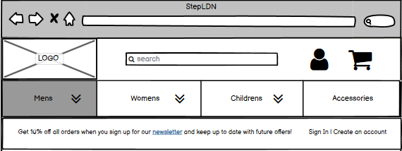

# StepLDN

## Introduction

<!--Write intro -->

 

[Click here to go to the live website!](<!-- Insert AmIResponsive image -->) 

1. [Wireframes](#wireframes)
2. [User Stories](#user-stories)
3. [Objectives](#objectives)
4. [Features](#features)
    - [Navigation Bar](#navigation-bar)
    - [Links](#links)
    - [News Posts](#news-posts)
    - [Gallery Posts](#gallery-posts)
    - [Comments](#comments)
    - [Like](#like)
    - [Message](#message)
    - [Register](#register)
    - [Login](#login)
    - [Logout](#logout)
5. [Testing](#testing)
    - [HTML](#html)
    - [CSS](#css)
    - [Python](#python)
    - [Manual Testing](#manual-testing)
6. [Bugs](#bugs)
7. [Deployment](#deployment)
8. [Credits](#credits)
  
## Wireframes

### Home 

### Products

### Product Details

### Create Account

### Sign in 

### Sign out 

### My Account

In the interest of time, I ended up having one page to show both the account details and order history, but would like to impliment the my accounts page as shown in the wireframe along with the seperate my details page and order history page in my own time.

### Edit Details

### Bag

### Bag

## User stories

I used the GitHub projects board to log my user stories to help me manage my project. 
This helped me break the project down into smaller tasks that would be more manageable by moving them into the in-progress section whilst I focused on them. once a task was complete, I could move it into the done section to help me see my progress.

## Objectives

- I want the user to be able to see all products on one page but also have pages for the user to see the product details individually.
    - Was this achieved?
        -  Yes
    - How was this achieved?
        -  I had an all products view to be used on product.html and a product detail view to be used on product_detail.html both views getting information from the product model.

- I want the users to be able to sign up for an account, log in and out of the account.
    - Was this achieved?
        - Yes
    - How was this achieved?
        - Using all auth I was able to add a sign up page a log in page and a log out page that registers the details to allow each user to create their own account.

- I want the users to be able to add a product to their bag and view which products are in their bag.
    - Was this achieved?
        - Yes
    - How was this achieved?
        - This was done with two views, the first being view_bag allowing the user to view if their is anything in their bad on bag.html, and the second being add_to_bag allowing the user to press a button on the product_details.html page to add the item and view it on the bag.html page. 

- I want the users to be able to adjust the items in their bag.
    - Was this achieved?
        - Yes
    - How was this achieved?
        - Again this was done with two views, one to allow the user to adust the quantity of the items and another to delete the item from the bag.

- I want a summery of what is currently in the users shopping cart on the checkout page.
    - Was this achieved?
        - Yes
    - How was this achieved?
        - Withing the checkout view, i first request the information from the session of the bag and show this information using checkout.html.

- when the user has an account, I want the users to be able to comment on a piece of art.
    - Was this achieved?
        - Yes
    - How was this achieved?
        - In models.py I defined everything I need to make a comment in the Comment class, created a form in forms.py and used that within the post details view.

- I want the users to be able to make a purchase on the site.
    - Was this achieved?
        - Yes
    - How was this achieved?
        - Using stripe i was able to create a form for the users to fill out and purchase the items in their bag.

- I want the users to be able to see their previous orders
        - Yes
    - How was this achieved?
        - When the user is signed into their account the information of that users previous orders can be seen on profile.html under order history using the order_history view in the profiles app.

- I want the users to be able to sign up for a news letter.
    - Was this achieved?
        - Yes
    - How was this achieved?
        - In the home app there is a model 'subscribe' that is used in the index view, this view takes the users email address.

- I want the users to be able to leave a message for the site owner to read.
    - Was this achieved?
        - <!-- Half done, user can leave messgae, site owner cannot read this on site yet. -->
    - How was this achieved?
        - In the contact app there is a form the users can fill out, which they can find on contact.html page by clicking the contact us link in the footer. <!-- Add how the site owner can read this once done. -->

- I want the users to be able to leave a comment on a product.
    - Was this achieved?
        - <!-- Not yet. -->
    - How was this achieved?
        <!-- Add this once done -->
 
## Features

### Navigation Bar

- The navigation bar contains the links needed to use the website easily. This changes how it looks depending on a couple of things, if the user is logged in or out but also depending on the size of the screen it is being viewed on.

### Links

- On the home page I have two links that are used to take the user to the two main pages on the site.

### News Posts

- Each news post contains a link in its title, these links take the user to the relevent news post detail page to read more. 

### Gallery Posts

-  Each gallery post contains a link in its title, these links take the user to the relevant gallery post detail page to read more. 

### Comments

- Within each gallery post details page the is a comment section, this allows the user to interact with the site, and have conversations about the art shown.

### Like

- On each gallery post in their details page you have the ability to like or dislike a post

### Message

- when a user logs in or out they will see a message pop up and automatically leave after a few seconds.

### Register

- The register function allows the user to create a profile so that they can log in and out of the site.

### Login

- The login function allows the user to log into their account so that they can like a post or leave a comment.

### Logout

- the log out function allows the user to sign out after they are finished on the site.

## Testing

### HTML

HTML was tested using the official [W3C validator](https://validator.w3.org/nu/) 

The following errors/warnings were found:

1. lang missing from <html> tag.
    - To fix this i just added lang="en" to the <html> tag.

Retested: Warning cleared

2. An image must have an alt attribute.
    - For both of these errors I added and alt attribute to the images that have details of the image just in case the image doesn't load.

Retested: Error cleared

1. An image must have an alt attribute.
    - I had made the same mistake of forgetting to add an alt attribute on the gallery page so followed the same process to fix these errors.

Retested: Error cleared

1. Bad value on image element
    - To fix this I put it into the CSS style sheet.

2. The font element is obsolete 
    - I didn’t recognise this code so I searched for the code it gave me on the error page in my base.html and news_detail.html files and no results were found, I’m unsure where it has pulled this code from, and I believe the third error is also in relation to this.

1. Element div not allowed as child of element h2 
    - I didn't recognise this code so I searched for h2 in my base.html and news_detail.html files and no results were found.

2. No p element in scope but a p end tag seen.
    - i searched for a stray 
 but none were found in either file.

### CSS
 
CSS was tested using the official [(Jigsaw) validator](https://jigsaw.w3.org/css-validator/)

No errors were found:

### Python
 
Python was tested using the official [PEP8](http://pep8online.com/)

The following errors were found:

To fix these all I had to do was extend the code onto the next line, all of these errors were caused by comments.

### Manual Testing 

Component | Function | Does it work? | Fixed? 
--------- | --------- | ----------------- | ------ |
Navbar: Home | Takes user to home page | Yes | N/A
Navbar: News| Takes user to news page | Yes | N/A
Navbar: Gallery | Takes user to gallery  | Yes | N/A
Navbar: Register | Takes user to the sign up page  | Yes | N/A
Navbar: Login | Takes user to the login page  | Yes | N/A
Navbar: logout | Takes user to the log out page  | Yes | N/A
Register: Sign up button | Allows user to sign up  | Yes | N/A
Login: Sign in button | Allows user to sign in  | Yes | N/A
Logout: Sign out button | Allows user to sign out  | Yes | N/A
News: News post slug links | Takes user to relevant news post details page  | Yes | N/A
Gallery: Post slug link | Takes user to relevant post details page | Yes | N/A
Gallery posts: like and unlike button | Allows user to like or unlike a post when logged in  | Yes | N/A
Gallery posts: Submit button | Allows user to leave a comment for the admin to validate and eventually for everyone to view on the page  | Yes | N/A

## Bugs

I ran into this error message:

I realised that I was missing news/ from my news/< slug:slug >/ in my urls.py file, when I changed that it worked but my page wasn't rendering correctly.

This is how it rendered:	

I originally had written return render(request, "news_detail.html")
so I tried this:

This didnt work so I also tried:

Then I noticed a spelling error in the first attempt I had written new_detail.html when I was supposed to write news_detail.html and then it all worked.

## Deployment

- Create a new app on heroku 
- In resources add heroku postgres
- In settings review config vars, copy the DATABASE_URL
- In gitpod make a file called env.py, use this to store our environment variables.
- make sure env.py is in gitignore file
- Add your secret key environment variable to both the env.py file and heroku config vars
- Reference the env file in the settings.py file.
- Add the secret key environment variable to settings.py.
- Highlight database section and comment it out, 
replace with the following:
DATABASES = {
   'default': dj_database_url.parse(os.environ.get("DATABASE_URL"))
}
- run migrations

## Credits

Thankyou to tutor support for helping me figure out my bug.

The run through project was helpful for getting me through this project I went back to see how classes were used throughout the making.

Gallery images from: https://www.istockphoto.com/

News content: https://visitlondon.com/things-to-do/whats-on/art-and-exhibitions/top-10-exhibitions

Am I responsive: http://ami.responsivedesign.is/

https://www.shutterstock.com/
word tracker - https://www.wordtracker.com/?fpr=refer&fp_sid=bingof
    
HTML was tested using the official [W3C validator](https://validator.w3.org/nu/) 
CSS was tested using the official [(Jigsaw) validator](https://jigsaw.w3.org/css-validator/)
Python was tested using the official [PEP8](http://pep8online.com/)